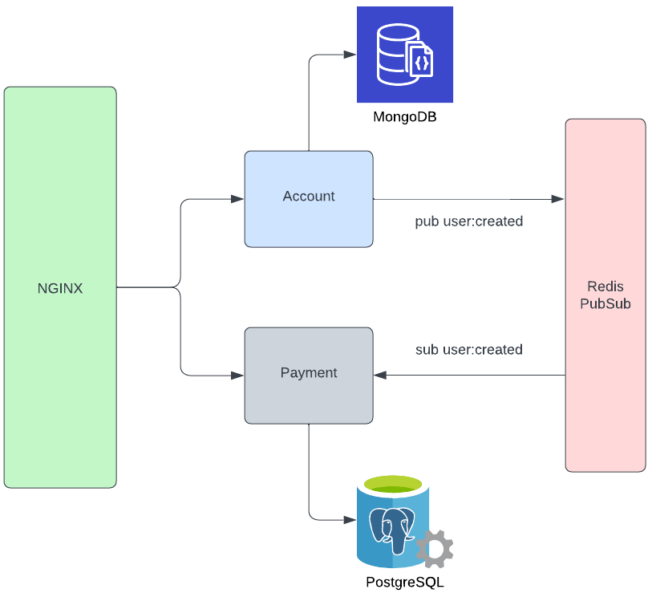

# Microservices Payment Application

This project is a microservices-based payment application consisting of two main services: Account and Payment. It uses NGINX as a reverse proxy and Redis PubSub for data synchronization between services.



## Architecture Overview

- **NGINX**: Acts as a reverse proxy, routing requests to appropriate services.
- **Account Service**: Handles user authentication and account management.
  - Framework: Gin (Golang)
  - Database: MongoDB
- **Payment Service**: Manages payment operations and transactions.
  - Framework: Fastify (TypeScript)
  - Database: PostgreSQL
- **Redis PubSub**: Facilitates real-time data synchronization between services.

## Setup and Running

1. **Environment Setup**:

   - Navigate to the `account` and `payment` folders.
   - Adjust the `.env` files in each folder according to your configuration.

2. **Docker Deployment**:

   - Ensure Docker and Docker Compose are installed on your system.
   - From the root directory, run:

     ```
     docker-compose up
     ```

   - This command will build and start all necessary containers.

## API Documentation

The complete API documentation is available on Postman:
[API Documentation](https://documenter.getpostman.com/view/16401831/2sA3s9D8oi)

### Key Endpoints

#### Authentication

- `POST /auth/signin`: Sign in to an existing account
- `POST /auth/signup`: Create a new account
- `POST /auth/signout`: Sign out (removes access_token from httponly cookie)
- `GET /auth/me`: Get current user information

#### Payments

- `POST /payments/accounts`: Create a payment account
- `POST /payments/deposit`: Deposit funds
- `POST /payments/send`: Send money
- `POST /payments/withdraw`: Withdraw funds
- `GET /payments/account`: Retrieve payment accounts
- `GET /payments/histories`: Get transaction history

## Flow Description

1. Client requests are routed through NGINX to the appropriate service.
2. The Account service handles user authentication and manages user data in MongoDB.
3. The Payment service processes financial transactions and stores data in PostgreSQL.
4. When a user is created or updated, the Account service publishes a `user:created` event via Redis PubSub.
5. The Payment service subscribes to the `user:created` event to sync user data for payment processing.

This architecture ensures real-time data consistency across services while maintaining separation of concerns.
